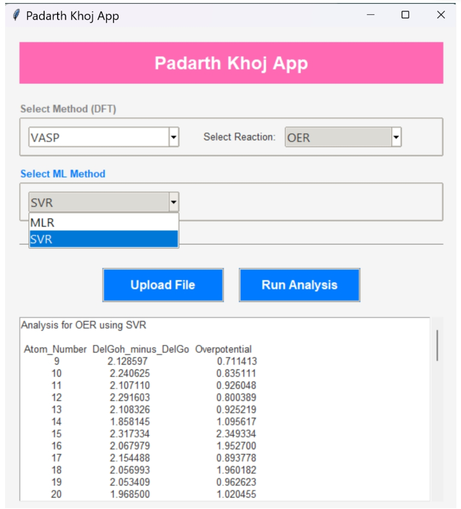
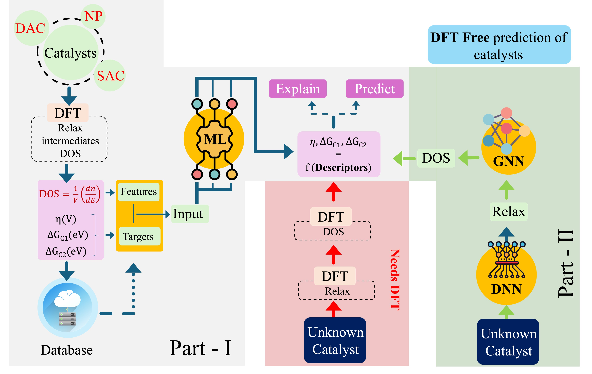
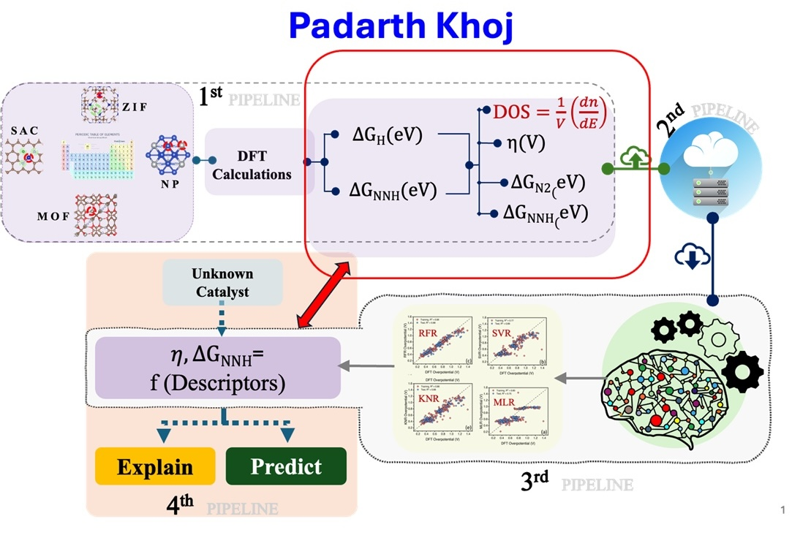

# padarthkhoj
#### Catalyst Activity Prediction using First-Principles and Graph Neural Networks and Interpretable Machine Learning

## padarthkhoj- OER/ORR

The graphical interface for OER and ORR operates through a streamlined sequence of steps. To begin, each material system undergoes two separate DFT computations: one dedicated to relaxing the atomic geometry and another to generate the density of states (DOS). After these simulations, the DOSCAR output is imported into the GUI. Internally, the interface applies the split_doscar routine to separate and compute the projected density of states (PDOS) for individual atoms. From the PDOS profiles, two key electronic descriptors are derived. These electronic descriptors estimates the energy descriptors and this energy descriptor serve as input to a predictive model that estimates the overpotential associated with OER and ORR activity in sp²-hybridized systems.

The workflow is built around a reduced-expensive computational strategy: each material undergoes only two DFT steps—structural relaxation and density-of-states (DOS) evaluation. The resulting CONTCAR and DOSCAR outputs are uploaded directly into the GUI. A customised PDOS parser—derived from the Python utility split_dos_11—extracts atom-resolved electronic contributions.

From the PDOS, the interface automatically calculates two key descriptors:

Dπ(EF): the Pz-orbital DOS at the Fermi level

R-Oπ: Relative occupancy, Pz-orbital electrons occupancy shift when graphene is doped or contains defects, compared to pristine graphene.

The GUI includes both SVR and multilinear regression (MLR) models for screening potential electrocatalysts. The extracted descriptors are supplied to the chosen model—SVR by default—which predicts the adsorption energies of *OH and *O intermediates. These outputs are translated into activity metrics:

ΔGOH for ORR

ΔGO − ΔGOH for OER
followed by the estimation of overpotentials for each site.

The predicted OER/ORR overpotentials show strong correspondence with reference DFT data and are supported by recent experimental reports (Bhardwaj et al., Small 2025, 2411035). This alignment demonstrates the reliability of the tool for accelerating catalyst discovery pipelines.

Users may freely switch between ML models (SVR or MLR). Once DOSCAR and CONTCAR of a sp2-hybridised structure is uploaded, the software reads the site-projected DOS produced by VASP, extracts electronic descriptors, feeds them through in the ML model, and returns downloadable output files listing predicted overpotentials for every atom coordination site-within seconds.

## padarthkhoj- CO2ER_1

## padarthkhoj- CO/CO2ER

## padarthkhoj- NRR

