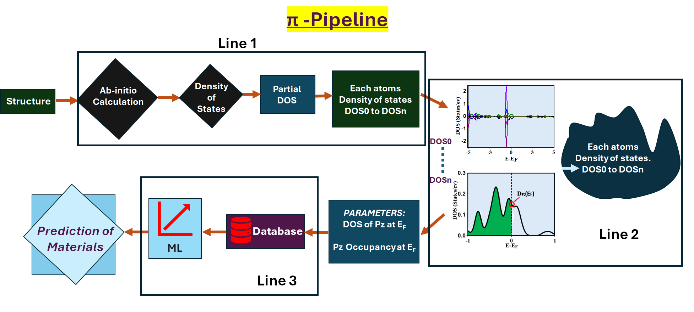
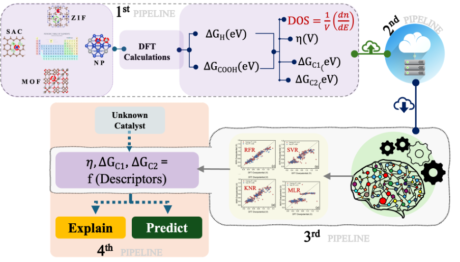

# padarthkhoj
#### Catalyst Activity Prediction using First-Principles and Graph Neural Networks and Interpretable Machine Learning

##padarthkhoj- OER/ORR

##padarthkhoj- CO2ER_1

##padarthkhoj- CO/CO2ER

##padarthkhoj- NRR

